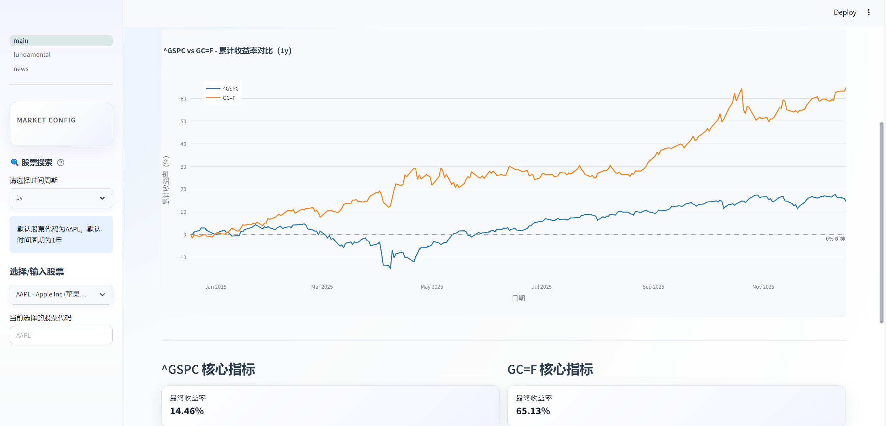

# 📈 Quantitative Stock Analysis Dashboard

[](https://finance-dashboard-demo.streamlit.app/)


> **A professional financial data visualization tool built with Streamlit, Pandas, and yfinance.**  
> Designed for real-time market analysis, automated technical indicator calculation (MACD/RSI), and trading signal detection.

---

## 📸 Project Demo (效果展示)

### 1. Market Overview (市场概览)
Real-time price tracking with professional Candlestick charts and key metrics cards.

*(Replace `assets/demo_main.png` with your actual screenshot path)*

### 2. Technical Analysis (技术指标)
Automated calculation of **MACD**, **RSI**, and **Moving Averages**. The system automatically flags **Overbought/Oversold** conditions.


### 3. Return Analysis (收益率分析)
Comparative analysis of daily returns and cumulative performance.


---

## 🚀 Key Features (核心功能)

- **📊 Real-time Data Engine:** 
  - Fetches live market data (US Stocks & China Concept Stocks) via `yfinance` API.
  - Performance optimized with `@st.cache_data`.

- **🧮 Advanced Quantitative Logic:** 
  - **Trend Analysis:** Simple/Exponential Moving Averages (SMA/EMA).
  - **Momentum Indicators:** RSI (Relative Strength Index) calculation implemented from scratch using Pandas (No "black box" libraries).
  - **Signal Detection:** MACD logic to identify Golden/Death Crosses.

- **🎨 Professional UI/UX:** 
  - Bloomberg-style layout with top-level Metric Cards.
  - Interactive charts powered by `mplfinance` / `plotly`.
  - Dynamic visual feedback (Green/Red indicators for price changes).

---

## 🛠️ Tech Stack (技术栈)

| Category | Technologies |
|----------|--------------|
| **Core Logic** | `Python` |
| **Data Processing** | `Pandas`, `NumPy` |
| **Visualization** | `Streamlit`, `Matplotlib`, `Mplfinance` |
| **Data Source** | `yfinance` |

---

## 📦 How to Run Locally (本地运行)

1. **Clone the repository:**
   ```bash
   git clone https://github.com/fearlessfk/Finance_Dashboard.git

2. **Install dependencies:**
   ```bash
   pip install -r requirements.txt

3. **Launch the app:**
   ```bash
   streamlit run main.py

---


## 🔮 Future Roadmap (未来规划)

-[ ]Integrate LSTM (Deep Learning) for price prediction.

-[ ]Add Portfolio Optimization (Markowitz Efficient Frontier).

-[ ]Implement SQL Database for historical data storage.

Created by [Alex Liu] | Targeting Quantitative Finance & Data Science Roles
